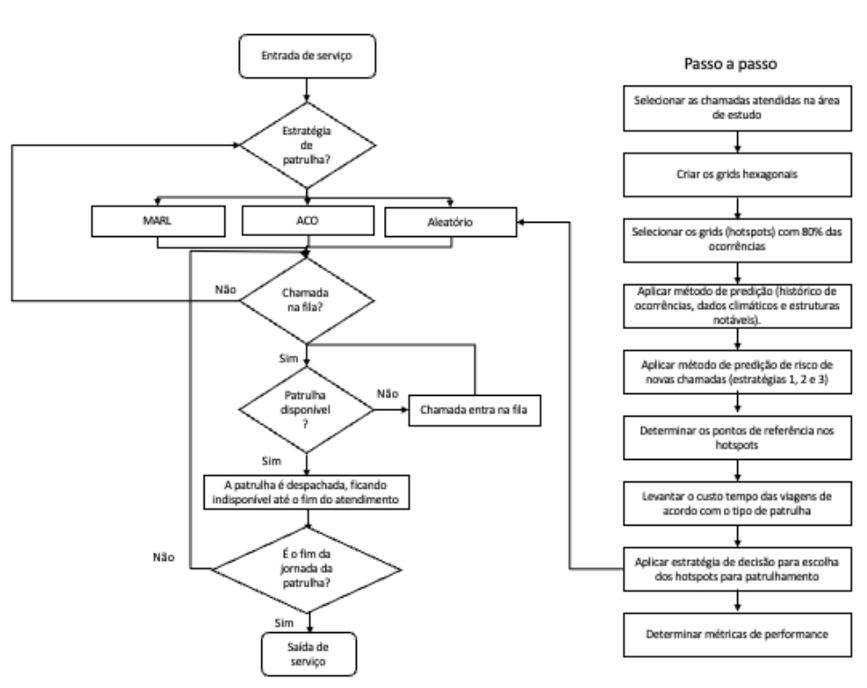

# Abordagem Multiagente na combinação de ações de patrulhamento preventivo e de atendimento de chamadas policiais

<!--  -->

Moacir Almeida Simões Júnior
Tobias de Abreu Kuse
<!-- Instituto de Informática, Universidade Federal do Rio Grande do Sul -->

<!-- ---

# Resumo do Projeto

Este trabalho propõe e avalia um modelo de **Aprendizado por Reforço Multiagente (MARL)** para o patrulhamento policial urbano.

- **Método:** Foi integrada uma arquitetura **Dueling DQN** a um **simulador de eventos discretos** que reproduz a operação policial minuto a minuto.
- **Formulação:** O problema é um **MDP multiagente cooperativo**, onde cada patrulha (agente) aprende uma política de posicionamento.
- **Recompensa:** Uma função **multiobjetivo** que busca conciliar metas conflitantes (tempo de resposta, cobertura de hotspots, etc.).
- **Principal Achado:** O MARL supera o patrulhamento aleatório e se aproxima de heurísticas especializadas, com destaque para ocorrências de prioridade intermediária.
 -->
---

# O Problema e os Objetivos

## O Desafio Central
Equilibrar dois objetivos conflitantes da atividade policial:
1.  **Patrulhamento Preventivo:** Maximizar a presença policial em áreas de alto risco (*hotspots*) para inibir crimes.
2.  **Atendimento Reativo:** Minimizar o tempo de resposta a chamadas de emergência.

## A Solução Proposta
Um **sistema multiagente (MARL)** onde as patrulhas são agentes autônomos que aprendem uma **política de patrulhamento** para otimizar ambos os objetivos simultaneamente.

---

# Metodologia: Visão Geral

## Ambiente de Simulação
- Baseado em **dados reais** do 9º Batalhão de Polícia Militar (Porto Alegre/RS).
- Utiliza um **grid hexagonal** para representar o espaço geográfico.

## Identificação de Hotspots
- Um modelo preditivo **(XGBoost)**, treinado com dados históricos, classifica os hexágonos com base no **risco de ocorrência** de eventos para as próximas 2 horas.

---

# Metodologia: Dinâmica da Simulação

<!--  -->

## Simulação de Eventos Discretos
- Desenvolvida em Python (`simpy`), modela a operação minuto a minuto.
- **Entidade Patrulha:** Evolui por estados (Disponível, Deslocamento, Atendimento, etc.).
- **Lógica do Despachante:** Regras fixas (mais próximo para P1, da própria área para P2/P3).
- **O MARL atua** quando a patrulha está no estado `DISPONÍVEL`, decidindo para onde ir.
- **Eventos Aleatórios:** A chegada de chamadas é modelada por uma **distribuição de Poisson** (para os intervalos entre chamadas). O tempo de atendimento de cada ocorrência é sorteado de uma **distribuição exponencial**.

---

# Metodologia: Formulação MARL

O problema é formulado como um **Processo de Decisão de Markov (MDP) multiagente e cooperativo**, definido pela tupla:
$\mathcal{M} = \langle \mathcal{A}, \mathcal{S}, \mathcal{U}, P, R, \gamma \rangle$

- **Agentes ($\mathcal{A}$):** As próprias patrulhas policiais.
- **Estado ($\mathcal{S}$):** Uma representação do ambiente (posições, filas, etc.).
- **Ações ($\mathcal{U}$):** O conjunto de vértices de patrulhamento que um agente pode escolher.
- **Transição ($P$):** A dinâmica do simulador, que atualiza o estado a cada minuto.
- **Recompensa ($R$):** Uma recompensa global compartilhada entre todos os agentes.
- **Fator de Desconto ($\gamma$):** Parâmetro que pondera a importância de recompensas futuras.

---

# Formulação MARL: Agentes e Estados

## Agentes (A)
Os **agentes** no modelo são as próprias **patrulhas policiais**.
- Cada patrulha opera como um agente de decisão independente.
- O objetivo é aprender uma política que contribua para o bem comum do sistema.

## Estado (S) vs. Observação ($o_i$)
- **Estado Global ($\mathcal{S}$):** A "verdade absoluta" do simulador (todas as patrulhas, chamadas, etc.).
- **Observação Local ($o_i$):** A visão **parcial** que cada agente `i` tem do mundo (o vetor de 19 dimensões), que é a entrada para sua rede neural.

---

# Formulação MARL: Ações e Transições

## Ações (U)
O **espaço de ações ($\mathcal{U}$)** define o que um agente pode fazer.
- É **discreto**: a ação ($u_i$) é a escolha de um **vértice de destino** para patrulhamento (hotspots ou quartéis).

## Transição (P)
A **função de transição ($P$)** são as "regras da física" do ambiente.
- É a própria **dinâmica do simulador**: processa as ações, introduz eventos aleatórios (chamadas) e atualiza o estado do mundo a cada minuto.

---

# Formulação MARL: Recompensa (R)

A recompensa é **global e compartilhada** para incentivar a cooperação.
$r_t = \alpha \cdot \Delta \text{atendidos}_t - \lambda_{\text{idle}} \cdot \widetilde{\Delta \text{idle}_t} - \lambda_{\text{resp}} \cdot \widetilde{\Delta \text{resp}_t} - \lambda_{\text{back}} \cdot \widetilde{\Delta \text{backlog}_t}$

- **Componentes da Recompensa:**
    - **$\Delta \text{atendidos}_t$ (Positivo):** Recompensa por chamados atendidos no minuto, ponderado pela prioridade. Incentiva a **eficiência**.
    - **$\widetilde{\Delta \text{idle}_t}$ (Negativo):** Penaliza o aumento da ociosidade acumulada nos hotspots. Incentiva a **prevenção**.
    - **$\widetilde{\Delta \text{resp}_t}$ (Negativo):** Penaliza o aumento do tempo de resposta acumulado (ponderado por prioridade). Incentiva a **agilidade**.
    - **$\widetilde{\Delta \text{backlog}_t}$ (Negativo):** Penaliza o aumento de chamadas esperando na fila. Incentiva a **capacidade do sistema**.
<!-- - Os hiperparâmetros $\alpha$ e $\lambda$s controlam o *trade-off* entre esses objetivos. -->

\* Os termos com til ($\widetilde{\cdot}$) representam versões normalizadas dos deltas.

---

# Metodologia: Arquitetura da Rede (Dueling DQN)

A função de valor $Q(o, u)$ de cada agente é aproximada por uma rede neural (MLP) com a arquitetura **Dueling DQN**.

Esta arquitetura possui dois "fluxos" separados:
1.  **Fluxo do Valor:** Estima o quão bom é o estado atual - $V(s)$.
2.  **Fluxo da Vantagem:** Estima a vantagem de cada ação naquele estado - $A(s, a)$.

Os dois ramos são combinados para gerar os Q-values finais, o que estabiliza o aprendizado:
$Q(s, a) = V(s) + (A(s, a) - \text{mean}(A(s, a)))$

<!-- ---

# Metodologia: Processo de Treinamento

O treinamento utiliza técnicas padrão de Deep RL para estabilidade e eficiência:

- **Experience Replay:** As transições $(s, a, r, s')$ são armazenadas em um *replay buffer*. O treinamento é feito em lotes amostrados aleatoriamente deste buffer para quebrar a correlação entre as amostras.

- **Rede-Alvo (Target Network):** Uma segunda rede, com pesos "congelados", é usada para calcular o valor do estado futuro. Seus pesos são atualizados com menos frequência para evitar instabilidade no cálculo da perda (loss).

- **Política $\epsilon$-Greedy:** Para balancear exploração e explotação, o agente escolhe uma ação aleatória com probabilidade $\epsilon$, que decai ao longo do treinamento. -->

---

# Validação: Setup Experimental

## Estratégias Comparadas
1.  **MARL_8:** A melhor configuração encontrada para o modelo MARL após vários experimentos.
2.  **BAPS:** Uma heurística forte (baseada em Otimização por Colônia de Formigas) usada como baseline de alto desempenho.
3.  **ALEATÓRIO:** Uma baseline simples onde as patrulhas escolhem destinos aleatoriamente.

## Condições de Avaliação
- Foram realizadas 3 execuções de simulação com horizonte de 7 dias.
- Para garantir uma comparação justa, **todas as estratégias foram avaliadas sob o mesmo conjunto de chamadas geradas**.

---

# Resultados: Comparação Geral

<!-- ## Métricas de Desempenho (Médias de 3 Execuções) -->
| Método    | Ociosidade | Fila | Deslocamento | Tempo Resposta |
| :-------- | :---------- | :---- | :-------------- | :---------------- |
| ALEATÓRIO | 4843.14     | 39.52 | **7.03**        | 46.54             |
| BAPS      | **4516.59** | **27.93** | 7.10        | **35.03**         |
| MARL_8    | 4645.42     | 34.47 | 7.25            | 41.71             |

## Análise
<!-- - A heurística **BAPS** apresentou o melhor desempenho global. -->
- A heurística **BAPS** (guiada por risco) se confirmou como a mais eficiente no geral, alcançando os menores tempos de resposta, fila e ociosidade.
- O modelo **MARL_8** superou significativamente a baseline **ALEATÓRIA** em todas as métricas.
- O resultado do **MARL** é promissor, pois se aproxima de uma heurística forte, validando que o agente aprendeu uma política coerente.

* Valores médios de 3 execuções de simulação independentes.

---

# Resultados: Análise por Prioridade de Fila

<!-- ## Tempo Médio na Fila de Espera (em minutos) -->
| Prioridade | ALEATÓRIO | BAPS    | MARL_8 |
| :--- | :--- | :--- | :--- |
| **Prioridade 1 (Crítica)** | 5.04 | **0.00** | 0.06 |
| **Prioridade 2 (Interm.)** | 49.82 | 25.73 | **15.22** |
| **Prioridade 3 (Baixa)** | 48.07 | **28.82** | 40.82 |

## Análise
- **P1:** BAPS e MARL_8 são quase ótimos, zerando a fila para chamadas críticas.
- **P3:** BAPS é melhor. O MARL sacrifica o desempenho em baixa prioridade para otimizar as demais, um comportamento esperado e ajustável.
- **P2:** O MARL-8 foi **superior à heurística BAPS**, indicando que o agente aprendeu uma política de posicionamento mais eficaz para chamadas de prioridade intermediária.

---

# Resultados: O Achado Principal (Prioridade 2)

O modelo **MARL_8** apresentou um desempenho **superior** ao da heurística BAPS para chamadas de prioridade intermediária.

- **Fila Média (Prioridade 2):**
    - **MARL_8:** **15.22 min**
    - **BAPS:** 25.73 min

## Hipótese
A abordagem **MARL** aprendeu uma política de patrulhamento mais sofisticada. Ela parece ter identificado um padrão de posicionamento que equilibra melhor a cobertura de zonas de alto risco com a necessidade de estar próximo a áreas de demanda moderada, algo que a heurística, com suas regras mais rígidas, não captura explicitamente.

---

# Conclusão

## Principais Conclusões
- A heurística **BAPS** se mostrou mais eficiente no agregado, mas o **MARL** é altamente competitivo.
- O **MARL se destacou na prioridade 2**, indicando que aprendeu políticas de posicionamento complexas e não óbvias.
- É possível obter ganhos operacionais relevantes **ajustando apenas o padrão de patrulhamento** (o que o MARL faz), sem alterar as regras de despacho.

## Contribuições
- Integração de patrulhamento preventivo e reativo em um único simulador.
- Formulação do problema como MDP multiagente com recompensa multiobjetivo.
- Validação empírica com dados reais de uma unidade policial brasileira.

---

# Trabalhos Futuros

1.  **Estender o MARL para o Despacho:** Modelar o despachante também como um agente de RL, permitindo o aprendizado de políticas de despacho dinâmicas, em vez de usar regras fixas.

2.  **Funções de Recompensa Adaptativas:** Investigar recompensas que se ajustem por prioridade, para calibrar de forma mais fina o trade-off entre os diferentes níveis de criticidade das chamadas.

3.  **Análise de Robustez e Transferibilidade:** Avaliar o desempenho do modelo em diferentes cenários de demanda (e.g., eventos especiais, crises) e testar a transferibilidade das políticas aprendidas para outras cidades ou contextos operacionais.

---

# Obrigado! 🙌  
Perguntas?

