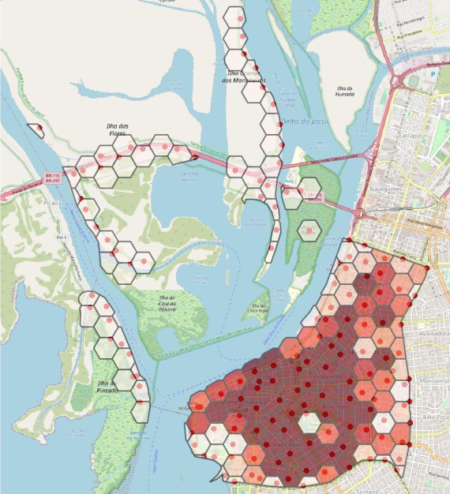
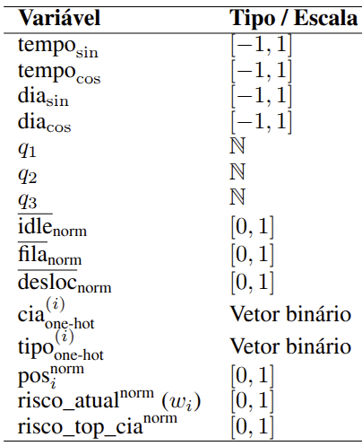

# Abordagem Multiagente na Combinação de Ações de Patrulhamento Preventivo e de Atendimento de Chamadas Policiais

Moacir Almeida Simões Júnior
Tobias de Abreu Kuse

---

# O Problema e os Objetivos

## O Desafio Central
Equilibrar dois objetivos conflitantes da atividade policial:
1.  **Patrulhamento Preventivo:** Maximizar a presença policial em áreas de alto risco (*hotspots*) para inibir crimes.
2.  **Atendimento Reativo:** Minimizar o tempo de resposta a chamadas de emergência.

## A Solução Proposta
Um **sistema multiagente (MARL)** onde as patrulhas são agentes autônomos que aprendem uma **política de patrulhamento** para otimizar ambos os objetivos simultaneamente.

---

# Setup do Ambiente

## Ambiente de Simulação
- Baseado em **dados reais** do 9º Batalhão de Polícia Militar (Porto Alegre/RS).
- Utiliza um **grid hexagonal** para representar o espaço geográfico.

## Identificação de Hotspots
- Um modelo preditivo **(XGBoost)**, treinado com dados históricos, classifica os hexágonos com base no **risco de ocorrência** de eventos para as próximas 2 horas.

---

<!-- # Metodologia: Dinâmica da Simulação -->
# Dinâmica da Simulação

<!-- ## Simulação de Eventos Discretos -->

<!-- O ambiente simula a operação policial com base em eventos estocásticos: -->

### 1. Geração de Chamadas (Estocástico)
<!-- A chegada de novas ocorrências é modelada por processos aleatórios: -->
- **Intervalo entre Chamadas:** Segue uma **distribuição de Poisson**.
- **Duração do Atendimento:** O tempo para resolver uma ocorrência segue uma **distribuição Exponencial**.
<!-- - **Prioridades:** As chamadas são classificadas em 3 níveis de criticidade. -->

### 2. Despacho e Fila (Regras)
- **Regras de Despacho:** A alocação de viaturas segue regras operacionais fixas:
    - **Prioridade 1:** Patrulha mais próxima.
    - **Prioridade 2 e 3:** Patrulha da própria área (Companhia).
- **Fila de Espera:** Nenhuma patrulha disponível.

<!-- - **Fila de Espera:** Se nenhuma patrulha estiver disponível, a chamada entra em uma fila FIFO, ordenada por prioridade. -->

---

# Formulação MARL

O problema é formulado como um **Processo de Decisão de Markov (MDP) multiagente cooperativo**, definido pela tupla:
$\mathcal{M} = \langle \mathcal{A}, \mathcal{S}, \mathcal{U}, P, R, \gamma \rangle$

- **Agentes ($\mathcal{A}$):** O conjunto de agentes (patrulhas).
- **Estado ($\mathcal{S}$):** O espaço de estados global.
- **Ações ($\mathcal{U}$):** O conjunto de ações possíveis (seleção de vértices de patrulhamento).
- **Transição ($P$):** A função de transição estocástica.
- **Recompensa ($R$):** A função de recompensa compartilhada.
- **Fator de Desconto ($\gamma$):** Parâmetro que pondera a importância de recompensas futuras.

---

# Os Agentes ($\mathcal{A}$)

Os **agentes** são as próprias **patrulhas policiais** individuais. Suas principais características são:

- **Autonomia e Descentralização:** Cada patrulha decide para onde patrulhar de forma autônoma, com base em sua visão local do ambiente. Todos os agentes utilizam a **mesma arquitetura de rede neural** (Dueling DQN) para tomar suas decisões.

- **Cooperação:** Agentes trabalham juntos, incentivados por uma **recompensa global** compartilhada, para beneficiar o sistema como um todo.

- **Política:** O objetivo é encontrar uma **política de movimentação ($\pi$)** ótima. Essa política representa a estratégia ideal para selecionar a sequência de vértices a serem patrulhados.

- **Visão Parcial:** O agente opera com base em uma **observação local ($o_i$)**, um vetor de 19 informações, sem acesso ao estado global completo.

---

<!-- # Formulação MARL: Estados e Observações -->
# Estados($\mathcal{S}$) | Observações($o_i$)

- O **Estado ($\mathcal{S}$)** contém toda a informação do ambiente, mas o agente decide com base apenas na **Observação ($o_i$)**, um subconjunto parcial de dados que entra na rede neural.

O vetor de observação ($o_i$) possui 19 componentes, agrupados em 4 categorias:
1.  **Informações Temporais:** Hora do dia e dia da semana.
2.  **Métricas Operacionais:** Desempenho geral do sistema (filas, ociosidade).
3.  **Dados do Próprio Agente:** Sua localização, tipo e companhia.
4.  **Informações de Risco:** Nível de risco do local atual e da sua área.

---

# Ações ($\mathcal{U}$) e Transições ($P$)

### Ações
A **ação ($u_{i,t}$)** é a decisão que um agente $i$ toma no minuto $t$ quando está disponível. A ação é a **escolha de um vértice de destino** para patrulhar. As ações de todos os agentes é o vetor:
$\mathbf{u}_t = (u_{1,t}, u_{2,t}, \dots, u_{|\mathcal{A}|,t})$

### Transição
A **função de transição** descreve como o estado evolui, gerando $s_{t+1}$ a partir de:
1. O estado atual $s_t$ (o **estado global** completo do ambiente).
2. A ação conjunta dos agentes $\mathbf{u}_t$.
3. A **tabela de eventos ($\mathcal{E}$)**, com incidentes pré-gerados para um **episódio**.

$s_{t+1} \sim P(\cdot \mid s_t, \mathbf{u}_t, \mathcal{E})$

---

# Recompensa (R)

A recompensa é **global e compartilhada** para incentivar a cooperação.
$r_t = \alpha \cdot \Delta \text{atendidos}_t - \lambda_{\text{idle}} \cdot \widetilde{\Delta \text{idle}_t} - \lambda_{\text{resp}} \cdot \widetilde{\Delta \text{resp}_t} - \lambda_{\text{back}} \cdot \widetilde{\Delta \text{backlog}_t}$

- **Componentes da Recompensa:**
    - **$\Delta \text{atendidos}_t$:** Recompensa por chamados atendidos no minuto, ponderado pela prioridade. Incentiva a **eficiência**.
    - **$\widetilde{\Delta \text{idle}_t}$:** Penaliza o aumento da ociosidade acumulada nos hotspots. Incentiva a **prevenção**.
    - **$\widetilde{\Delta \text{resp}_t}$:** Penaliza o aumento do tempo de resposta acumulado (ponderado por prioridade). Incentiva a **agilidade**.
    - **$\widetilde{\Delta \text{backlog}_t}$:** Penaliza o aumento de chamadas esperando na fila. Incentiva a **capacidade do sistema**.
<!-- - Os hiperparâmetros $\alpha$ e $\lambda$s controlam o *trade-off* entre esses objetivos. -->

\* Os termos com til ($\widetilde{\cdot}$) representam versões normalizadas dos deltas.

---

# Arquitetura da Rede (Dueling DQN)

A função de valor $Q(o, u)$ de cada agente é aproximada por uma rede neural (MLP) com a arquitetura **Dueling DQN**.

Esta arquitetura possui dois "fluxos" separados:
1.  **Fluxo do Valor:** Estima o quão bom é o estado atual - $V(s)$.
2.  **Fluxo da Vantagem:** Estima a vantagem de cada ação naquele estado - $A(s, a)$.

Os dois ramos são combinados para gerar os Q-values finais, o que estabiliza o aprendizado:
$Q(s, a) = V(s) + (A(s, a) - \text{mean}(A(s, a)))$

---

# Validação: Setup Experimental

## Estratégias Comparadas
1.  **MARL_8:** A melhor configuração encontrada para o modelo MARL após vários experimentos.
2.  **BAPS:** Uma heurística forte (baseada em Otimização por Colônia de Formigas) usada como baseline de alto desempenho.
3.  **ALEATÓRIO:** Uma baseline simples onde as patrulhas escolhem destinos aleatoriamente.

## Condições de Avaliação
- Foram realizadas 3 execuções de simulação com horizonte de 7 dias.
- Para garantir uma comparação justa, **todas as estratégias foram avaliadas sob o mesmo conjunto de chamadas geradas**.

---

# Resultados: Comparação Geral

<!-- ## Métricas de Desempenho (Médias de 3 Execuções) -->
| Método    | Ociosidade | Fila | Deslocamento | Tempo Resposta |
| :-------- | :---------- | :---- | :-------------- | :---------------- |
| ALEATÓRIO | 4843.14     | 39.52 | **7.03**        | 46.54             |
| BAPS      | **4516.59** | **27.93** | 7.10        | **35.03**         |
| MARL_8    | 4645.42     | 34.47 | 7.25            | 41.71             |

## Análise
<!-- - A heurística **BAPS** apresentou o melhor desempenho global. -->
- A heurística **BAPS** (guiada por risco) se confirmou como a mais eficiente no geral, alcançando os menores tempos de resposta, fila e ociosidade.
- O modelo **MARL_8** superou significativamente a baseline **ALEATÓRIA** em todas as métricas.
- O resultado do **MARL** é promissor, pois se aproxima de uma heurística forte, validando que o agente aprendeu uma política coerente.

* Valores médios de 3 execuções de simulação independentes.

---

# Resultados: Análise por Prioridade de Fila

<!-- ## Tempo Médio na Fila de Espera (em minutos) -->
| Prioridade | ALEATÓRIO | BAPS    | MARL_8 |
| :--- | :--- | :--- | :--- |
| **Prioridade 1 (Crítica)** | 5.04 | **0.00** | 0.06 |
| **Prioridade 2 (Interm.)** | 49.82 | 25.73 | **15.22** |
| **Prioridade 3 (Baixa)** | 48.07 | **28.82** | 40.82 |

## Análise
- **P1:** BAPS e MARL_8 são quase ótimos, zerando a fila para chamadas críticas.
- **P3:** BAPS é melhor. O MARL sacrifica o desempenho em baixa prioridade para otimizar as demais, um comportamento esperado e ajustável.
- **P2:** O MARL-8 foi **superior à heurística BAPS**, indicando que o agente aprendeu uma política de posicionamento mais eficaz para chamadas de prioridade intermediária.

---

# Resultados: O Achado Principal (Prioridade 2)

O modelo **MARL_8** apresentou um desempenho **superior** ao da heurística BAPS para chamadas de prioridade intermediária.

- **Fila Média (Prioridade 2):**
    - **MARL_8:** **15.22 min**
    - **BAPS:** 25.73 min

## Hipótese
A abordagem **MARL** aprendeu uma política de patrulhamento mais sofisticada. Ela parece ter identificado um padrão de posicionamento que equilibra melhor a cobertura de zonas de alto risco com a necessidade de estar próximo a áreas de demanda moderada, algo que a heurística, com suas regras mais rígidas, não captura explicitamente.

---

# Conclusão

## Principais Conclusões
- A heurística **BAPS** se mostrou mais eficiente no agregado, mas o **MARL** é altamente competitivo.
- O **MARL se destacou na prioridade 2**, indicando que aprendeu políticas de posicionamento complexas e não óbvias.
- É possível obter ganhos operacionais relevantes **ajustando apenas o padrão de patrulhamento** (o que o MARL faz), sem alterar as regras de despacho.

## Contribuições
- Integração de patrulhamento preventivo e reativo em um único simulador.
- Formulação do problema como MDP multiagente com recompensa multiobjetivo.
- Validação empírica com dados reais de uma unidade policial brasileira.

---

# Trabalhos Futuros

1.  **Estender o MARL para o Despacho:** Modelar o despachante também como um agente de RL, permitindo o aprendizado de políticas de despacho dinâmicas, em vez de usar regras fixas.

2.  **Funções de Recompensa Adaptativas:** Investigar recompensas que se ajustem por prioridade, para calibrar de forma mais fina o trade-off entre os diferentes níveis de criticidade das chamadas.

3.  **Análise de Robustez e Transferibilidade:** Avaliar o desempenho do modelo em diferentes cenários de demanda (e.g., eventos especiais, crises) e testar a transferibilidade das políticas aprendidas para outras cidades ou contextos operacionais.

---

# Obrigado! 🙌  
Perguntas?

